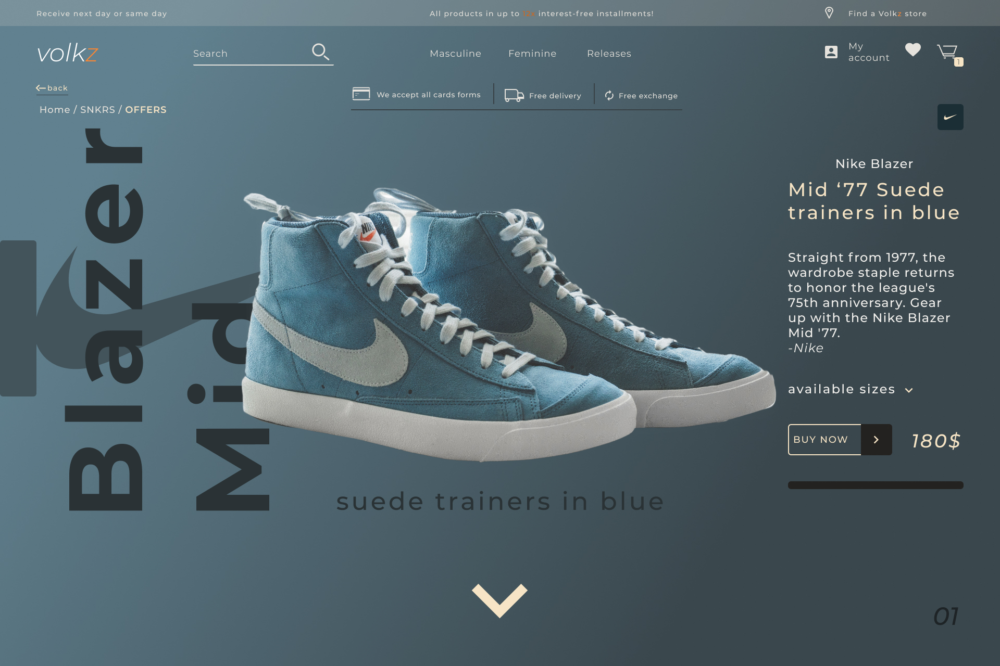
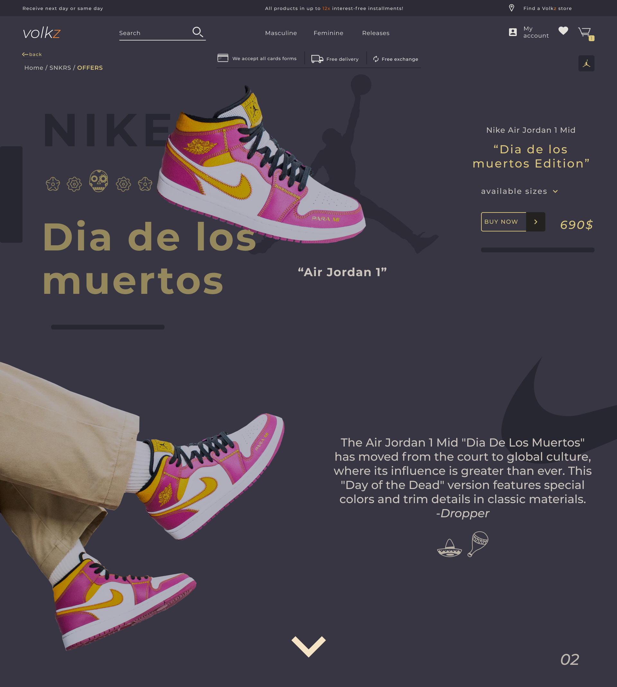
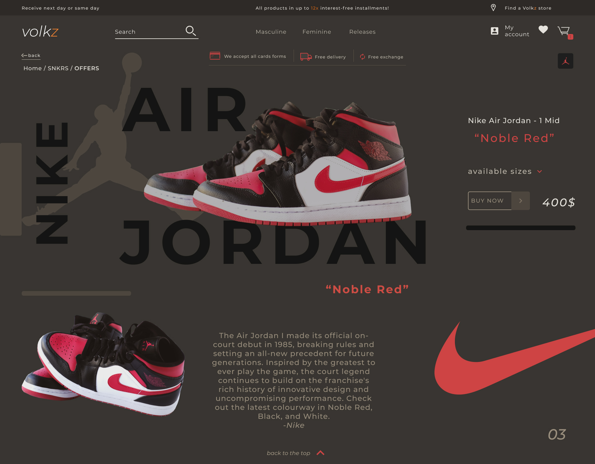
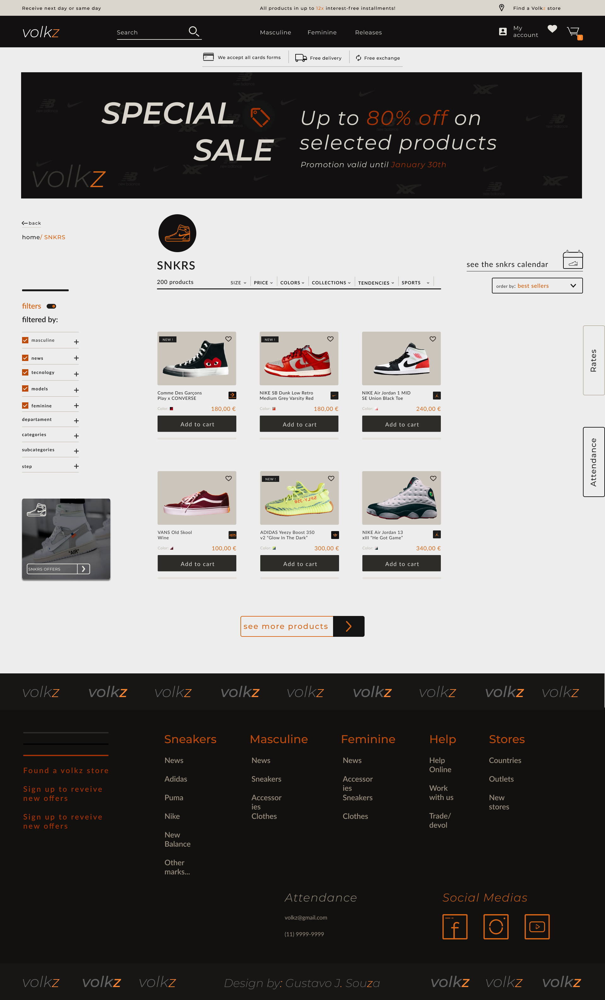

<h1>Volkz Store Project 👜</h1>

 

(It's just layout so there's no backend :).)

This is a project based on my User Experience and User Interface classes where I wanted to create a store specialized in selling clothes and sneakers from famous brands. I used various websites as inspiration, for example: Nike, Puma, Adidas, New Balance and also Artwalk.
All the photos I used I got from https://unsplash.com
Some icons I created myself :D.

Fimga Link: https://www.figma.com/proto/iHgbHxg2yPWcblWECPkaKF/Volkz-Export?page-id=0%3A1&node-id=2%3A2972&viewport=344%2C48%2C0.11&scaling=min-zoom&starting-point-node-id=2%3A2972

</img>
</img>
</img>
</img>
</img>
</img>
</img>
</img>

